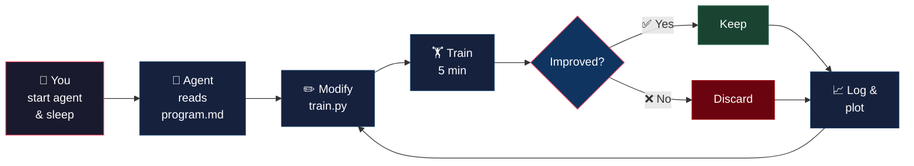
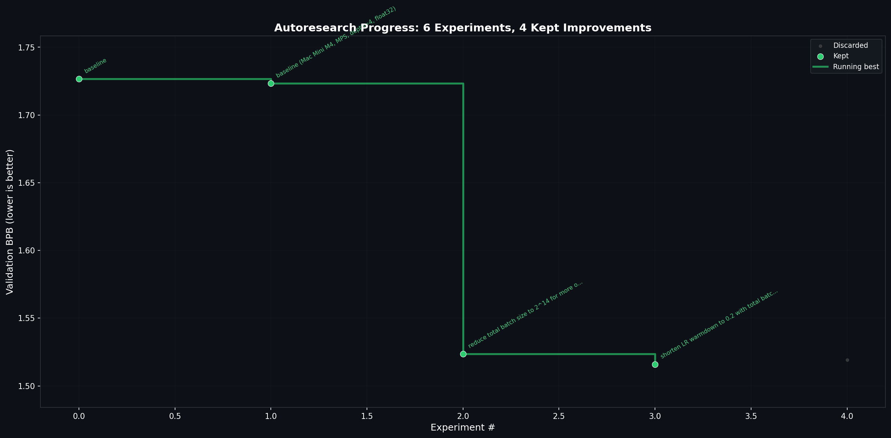

# autoresearch-mac-mini

**Fork of [karpathy/autoresearch](https://github.com/karpathy/autoresearch) that runs on a Mac Mini — no NVIDIA GPU required.**

Auto-detects your hardware and runs on **Apple Silicon (MPS)**, **CPU**, or **CUDA** — no code changes needed.

## What is this?

You give an AI coding agent (Claude, Codex, etc.) a small language model training setup and let it **experiment autonomously overnight**. The agent modifies the training code, trains for 5 minutes, checks if the model improved, keeps or discards the change, and repeats. You wake up to a log of experiments and a better model — all done while you slept.

The original [autoresearch](https://github.com/karpathy/autoresearch) by Andrej Karpathy requires an NVIDIA H100 GPU (~$30K). **This fork makes it work on your Mac Mini, MacBook, or any computer — no GPU required.**

### How the loop works



**You sleep. The agent experiments. You wake up to results.** ~8 experiments/hour, ~60 overnight.

## What do I need?

| Requirement | Details |
|------------|---------|
| **Computer** | Any Mac with Apple Silicon (M1/M2/M3/M4), or any Linux/Windows with Python |
| **RAM** | 8 GB minimum (the model uses ~200 MB). 16 GB recommended |
| **Disk** | ~2 GB for training data |
| **Python** | 3.10 or newer |
| **AI agent** | Claude Code, Codex, or any coding agent (this is what runs the experiments for you) |

> **Cost note:** The AI agent (Claude/Codex) uses API credits as it runs experiments. Expect ~$5-15 for an overnight run of ~60 experiments, depending on your provider and plan.

## Our results

We ran experiments on a Mac Mini M4 using different AI agents. Full results, charts, and configs are in the [`examples/`](examples/) folder.

| Hardware | Agent | Experiments | Baseline | Best val_bpb | Improvement | Details |
|----------|-------|-------------|----------|-------------|-------------|---------|
| Mac Mini M4 (16GB) | Claude Haiku + Codex | 10 | 1.729 | **1.470** | 15% | [results](examples/mac-mini-m4/) |


**Key finding:** On Mac Mini, **smaller models with more optimizer steps win.** The agent discovered that depth 3 beats depth 4 — fewer layers = faster steps = more updates in the 5-minute budget.

**Best config found:** DEPTH=3, TOTAL_BATCH=2^14, WARMDOWN=0.2, WEIGHT_DECAY=0.1

> Your results will differ — the agent optimizes for YOUR specific hardware. The [autoresearch-mlx](https://github.com/trevin-creator/autoresearch-mlx) fork pushed val_bpb down to **1.294** on M4 Max over longer runs.
>
> **Have results to share?** Add your own `examples/your-hardware/` folder and open a PR!

## Quick start

```bash
# 1. Install uv project manager (if you don't already have it)
curl -LsSf https://astral.sh/uv/install.sh | sh

# 2. Clone this repo
git clone https://github.com/Venkateshwar-PortoAI/autoresearch-mac-mini.git
cd autoresearch-mac-mini

# 3. Install dependencies
uv sync

# 4. Download data and train tokenizer (one-time, ~2 min)
uv run prepare.py

# 5. Run a single training experiment to verify (~7 min)
uv run train.py
```

The script will print which device it detected:
```
Device: mps
Compute dtype: torch.float32
```

If you see `val_bpb: X.XXX` at the end, everything works. You're ready to go autonomous.

## Running the agent (overnight mode)

Open your terminal in this directory and start your AI agent:

**Claude Code:**
```bash
claude
# then type: Hi have a look at program.md and let's kick off a new experiment! let's do the setup first.
```

**Codex:**
```bash
codex
# then type: Hi have a look at program.md and let's kick off a new experiment! let's do the setup first.
```

Then **leave it running overnight**. The agent will:
1. Modify `train.py` with an idea (change model size, learning rate, etc.)
2. Train for 5 minutes
3. Check if val_bpb improved
4. Keep or discard the change
5. Repeat forever until you stop it

**What to expect:**
- ~8 experiments per hour (~7 min each: 5 min training + 2 min eval)
- ~60 experiments overnight (8 hours)
- The agent finds hardware-optimal configs automatically
- Check `results.tsv` anytime to see progress

### Watching progress

**Progress chart** — run anytime to see how experiments are going:
```bash
uv run plot_progress.py
# opens progress.png
```



**Sticky terminal header** — the agent can use this for live status:
```bash
uv run run_experiment.py "reduce depth to 3"
```
```
━━━━━━━━━━━━━━━━━━━━━━━━━━━━━━━━━━━━━━━━━━━━━━━━━━━━━
  EXPERIMENT #4  ⏳ RUNNING    Testing: reduce depth to 3
  Best: 1.524  │  Done: 3  │  Kept: 2  │  Discarded: 1  │  Crashed: 0
━━━━━━━━━━━━━━━━━━━━━━━━━━━━━━━━━━━━━━━━━━━━━━━━━━━━━━
```

## Project structure

```
prepare.py         — data prep + runtime utilities (do not modify)
train.py           — model + training loop (the AI agent modifies this)
program.md         — instructions that tell the AI agent what to do
run_experiment.py  — experiment runner with sticky terminal header
plot_progress.py   — auto-generates progress.png chart
results.tsv        — log of all experiments (created during runs)
```

## Troubleshooting

| Problem | Fix |
|---------|-----|
| `uv: command not found` | Install uv: `curl -LsSf https://astral.sh/uv/install.sh \| sh` |
| `MPS not available` | Update to macOS 13+ and PyTorch 2.0+. Intel Macs don't have MPS — it'll fall back to CPU |
| Out of memory (OOM) | Edit `train.py`: lower `DEVICE_BATCH_SIZE` to 4 or 2, or lower `DEPTH` to 2 or 3 |
| Training very slow | Expected on CPU. MPS is ~10-20x faster. Consider leaving it overnight |
| `prepare.py` download fails | Check internet connection. Data is ~2 GB from HuggingFace |
| Agent stops/crashes | Just restart the agent. It reads `results.tsv` and picks up where it left off |

## What changed from upstream

| Change | Why |
|--------|-----|
| FA3 → PyTorch SDPA | Flash Attention 3 is CUDA-only. SDPA works everywhere |
| Auto device detection | `cuda` → `mps` → `cpu`, no hardcoded device |
| `torch.compile` disabled on MPS | Crashes on Metal |
| Float32 on MPS/CPU | bfloat16 is unreliable on Metal. Slower but correct |
| Smaller defaults | DEPTH=4, BATCH=8 (per Karpathy's own small-compute recommendations) |
| Reduced eval tokens | Faster validation on slower hardware |
| Removed `kernels` dependency | CUDA-only package |
| `run_experiment.py` | Sticky terminal header showing experiment progress |
| `plot_progress.py` | Auto-generates progress chart from results |

Everything else is identical to upstream — same model architecture, same Muon+AdamW optimizer, same agent loop, same metric (val_bpb).

## How it compares to other Mac forks

| | This repo | [autoresearch-macos](https://github.com/miolini/autoresearch-macos) | [autoresearch-mlx](https://github.com/trevin-creator/autoresearch-mlx) |
|---|---|---|---|
| **Backend** | PyTorch + MPS | PyTorch + MPS | MLX (no PyTorch) |
| **Platforms** | CUDA, MPS, CPU | macOS only | macOS only |
| **CUDA support** | Yes (auto-detect) | No (crashes on non-Mac) | No |
| **Progress UI** | Sticky terminal header + auto chart | None | None |
| **Diff from upstream** | Minimal | Minimal | Full rewrite |

## Credits

All credit to [@karpathy](https://github.com/karpathy) for the original [autoresearch](https://github.com/karpathy/autoresearch) concept and codebase.

## License

MIT
