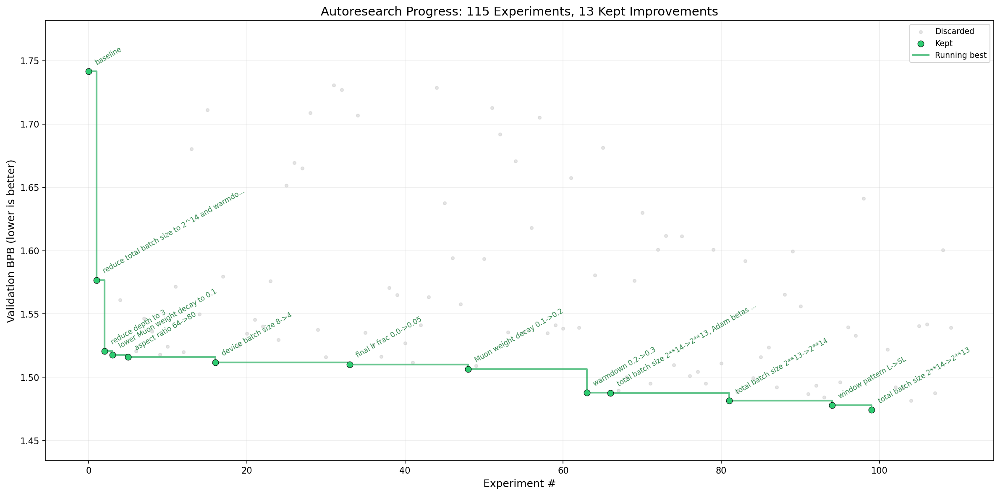

# Mac Mini M4 + OpenAI Codex — Full Run

**Hardware:** Mac Mini M4, 16GB unified memory, macOS
**Agent:** OpenAI Codex (gpt-5.4 high)
**Experiments:** 115
**Kept:** 13 | **Discarded:** 97 | **Crashed:** 5
**Best val_bpb:** 1.474309 (from baseline 1.742)
**Improvement:** 15.3%

## Progress



## Journey (all 13 kept improvements)

| Exp # | val_bpb | Change | Insight |
|-------|---------|--------|---------|
| 1 | 1.742 | baseline | starting point, DEPTH=4, BATCH=2^16 |
| 2 | 1.577 | batch 2^14 + warmdown 0.2 | biggest single win — more optimizer steps in 5 min |
| 3 | 1.521 | depth 4 → 3 | fewer layers = faster steps = more updates |
| 4 | 1.518 | weight decay 0.2 → 0.1 | small regularization tweak |
| 5 | 1.516 | aspect ratio 64 → 80 | wider model, same depth |
| 18 | 1.512 | device batch 8 → 4 | even more steps per 5 min |
| 35 | 1.510 | final LR frac 0 → 0.05 | don't zero out LR at end |
| 49 | 1.507 | weight decay 0.1 → 0.2 | slightly more regularization helped |
| 59 | 1.488 | warmdown 0.2 → 0.3 | longer cooldown |
| 64 | 1.488 | batch 2^13, betas (0.85, 0.95), depth 2 | radical combo change |
| 79 | 1.482 | batch 2^13 → 2^14 | reverted batch, kept depth 2 |
| 97 | 1.478 | window pattern L → SL | sliding window attention helped |
| 101 | 1.474 | batch 2^14 → 2^13 | back to smaller batches |

## Best config found

```python
DEPTH = 2
ASPECT_RATIO = 80
HEAD_DIM = 128
WINDOW_PATTERN = "SL"
TOTAL_BATCH_SIZE = 2**13
DEVICE_BATCH_SIZE = 4
EMBEDDING_LR = 0.6
UNEMBEDDING_LR = 0.004
MATRIX_LR = 0.04
SCALAR_LR = 0.5
WEIGHT_DECAY = 0.2
ADAM_BETAS = (0.85, 0.95)
WARMUP_RATIO = 0.0
WARMDOWN_RATIO = 0.3
FINAL_LR_FRAC = 0.05
```

## Key findings

1. **Smaller batches dominate on Mac Mini.** The agent kept pushing batch size down (2^16 → 2^14 → 2^13). More optimizer steps per 5-minute budget is the #1 lever.

2. **Depth 2 eventually beats depth 3.** Codex found this at experiment 64 — Haiku never went this low. Fewer layers = even faster steps.

3. **Sliding window attention (SL) helps.** Surprising — we defaulted to "L" (full attention) since SDPA doesn't have native sliding window. But the masking approach works and the pattern helps.

4. **Steady improvement over 100+ experiments.** Unlike Haiku which plateaued at experiment 5, Codex kept finding small wins all the way to experiment 101. Persistence pays.

5. **Crash rate was low (5/115 = 4%).** Most crashes were from aggressive changes (depth 5 with large batch). The agent learned to avoid these.

## Comparison with Haiku run

| | Claude Haiku | OpenAI Codex |
|---|---|---|
| Experiments | 10 | 115 |
| Best val_bpb | 1.470 | 1.474 |
| Kept improvements | 4 | 13 |
| Best depth | 3 | 2 |
| Crashes | 0 | 5 |
| Time running | ~1 hour | ~14 hours |
| Key strength | Found good config fast | Thorough parameter sweep |

Haiku got a slightly better val_bpb (1.470 vs 1.474) in just 10 experiments. But Codex explored far more of the search space and found architectural changes (depth 2, SL window) that Haiku never tried.
