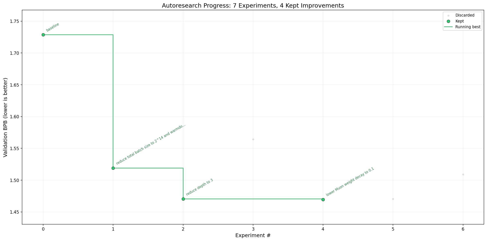

# Mac Mini M4 + Claude Haiku — Example Run

**Hardware:** Mac Mini M4, 16GB unified memory, macOS
**Agent:** Claude Haiku
**Experiments:** 10
**Best val_bpb:** 1.469533 (from baseline 1.728)

## Best config found

```
DEPTH = 3
TOTAL_BATCH_SIZE = 2**14
WARMDOWN_RATIO = 0.2
WEIGHT_DECAY = 0.1
MATRIX_LR = 0.04
DEVICE_BATCH_SIZE = 8
WINDOW_PATTERN = "L"
```

## Key findings

- **Smaller batch size (2^14)** was the biggest single win — more optimizer steps in 5 minutes
- **Depth 3 beats depth 4** — fewer layers = faster steps = more updates in the time budget
- **Lower weight decay (0.1)** gave a small additional improvement
- Reducing head dim, changing adam betas, and tweaking scalar LR all failed to improve

## Progress


